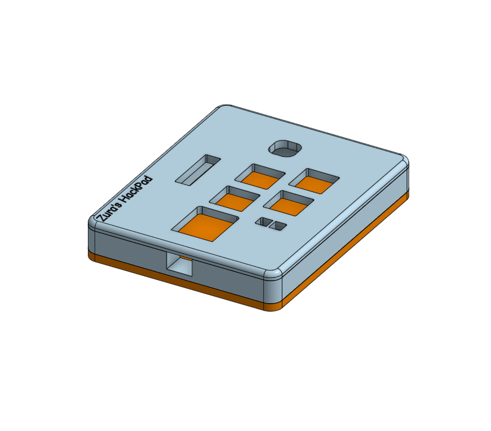

# Zura’s HackPad  
A fully custom Linux-focused macropad featuring 4 programmable hotkeys, a rotary encoder with push switch, RGB underglow, and a 0.91” I²C OLED display — all powered by a Seeed XIAO RP2040.  
Designed, modeled, and routed entirely for the Hack Club *Blueprint* program.

---

## Features

### Current Working Features
These are implemented in `main.py` now.

#### 4 Macro Keys
| Key | Name | Current Behavior |
|-----|------|------------------|
| **CP** | Copy | Sends `Ctrl + C` |
| **FC** | Folder Create | Sends `Ctrl + Shift + N` |
| **OT** | Open Terminal | Sends `Ctrl + Alt + T` |
| **LFN** | Fn Lock | Sends `F14` (used by Linux for Fn-Lock on some systems) |

#### Rotary Encoder
- Rotate: Volume Up / Down  
- Press: currently basic input (extended features planned)

#### RGB Underglow (SK6812 MINI)
- 2 LED chain  
- Controlled via GPIO0  
- Basic color output active (animations planned)

---

### Planned / Future Features

#### Smart Copy/Paste
- First press copies  
- Second press pastes  
- Clipboard-empty → paste anyway  

#### Encoder Modes
- Cycle between: Volume - Brightness - Media - Custom  

#### OLED Display
- Clipboard indicator  
- Volume & brightness  
- Battery/time  
- Overheat warning  
- Mode icons & animations  

---

## Bill of Materials (BOM)

| # | Component | Qty | Notes |
|---|-----------|-----|-------|
| 1 | Seeed XIAO RP2040 (TH) | 1 | Main MCU |
| 2 | MX Mechanical Switches | 4 | Cherry-MX compatible |
| 3 | EC11 Rotary Encoder w/ Switch | 1 | A/B/C pins + push |
| 4 | SK6812 MINI LEDs | 2 | DIN → DOUT chain |
| 5 | 0.91" I²C OLED Display | 1 | GND/VCC/SCL/SDA |
| 6 | 4-pin Female Header | 1 | For OLED |
| 7 | Keycaps | 4 | MX |
| 8 | M3 Screws + Heat-Set Inserts | 4 | Case |
| 9 | Custom PCB (2-layer) | 1 | ≤100×100 mm |

---

## System Layout  
(Directly from KiCad nets)

### Switches → XIAO
- SW1 → GPIO26  
- SW2 → GPIO27  
- SW3 → GPIO28  
- SW4 → GPIO29  

### Rotary Encoder
- A → GPIO2  
- B → GPIO4  
- C → GND  

### RGB LEDs (SK6812)
- MCU GPIO0 → D1 DIN  
- D1 DOUT → D2 DIN  
- VDD → +5V  
- VSS → GND  

### OLED Header (J1)
- Pin 1 → GND  
- Pin 2 → 3V3  
- Pin 3 → SCL (GPIO7)  
- Pin 4 → SDA (GPIO6)

---

## Project Structure

zuras-hackpad/
├── CAD/
│   ├── HackPad_Bottom.step
│   ├── HackPad_Top.step
│   └── HackPad_Assembly.step
├── PCB/
│   ├── HackPad.kicad_pro
│   ├── HackPad.kicad_sch
│   └── HackPad.kicad_pcb
├── Firmware/
│   └── main.py
├── Images/
│   ├── Bottom.png
│   ├── Debug.png
│   ├── Full.png
│   ├── PDC-Back.png
│   ├── PDC-Finish.png
│   ├── PDC-Front.png
│   ├── Schematic.png
│   └── Top.png
└── README.md

---

## Required Screenshots

### Top View  

### Bottom View  

### 3D Model  

### PCB – Front  

### PCB – Back  

### PCB – Final Routing  

### Schematic  

### Debug  

---

## Credits
Created by **Zura (LordZura)**  
Powered by **KiCad, Onshape, Seeed XIAO RP2040, KMK, Hack Club Blueprint**
