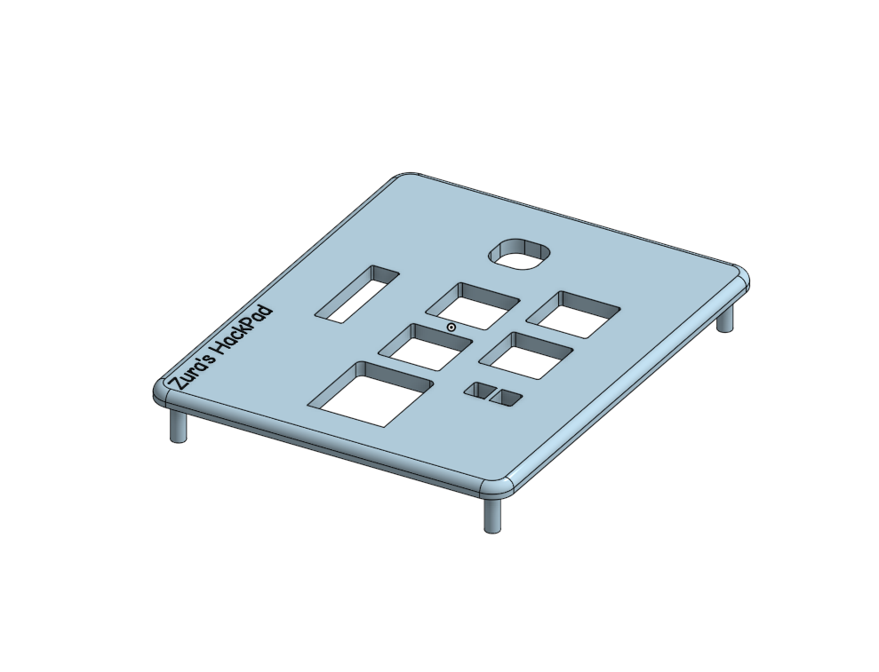
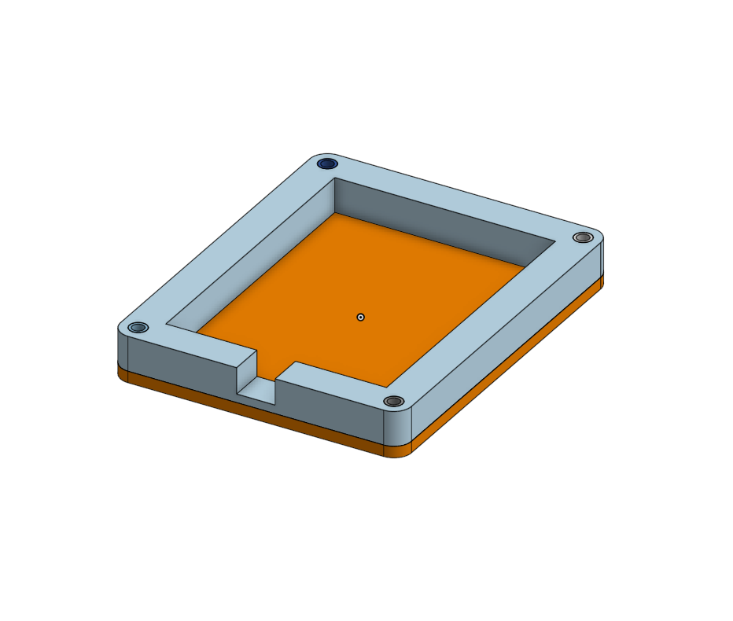
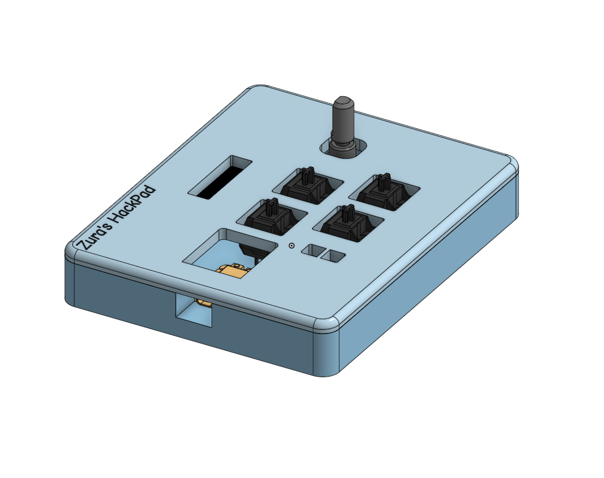
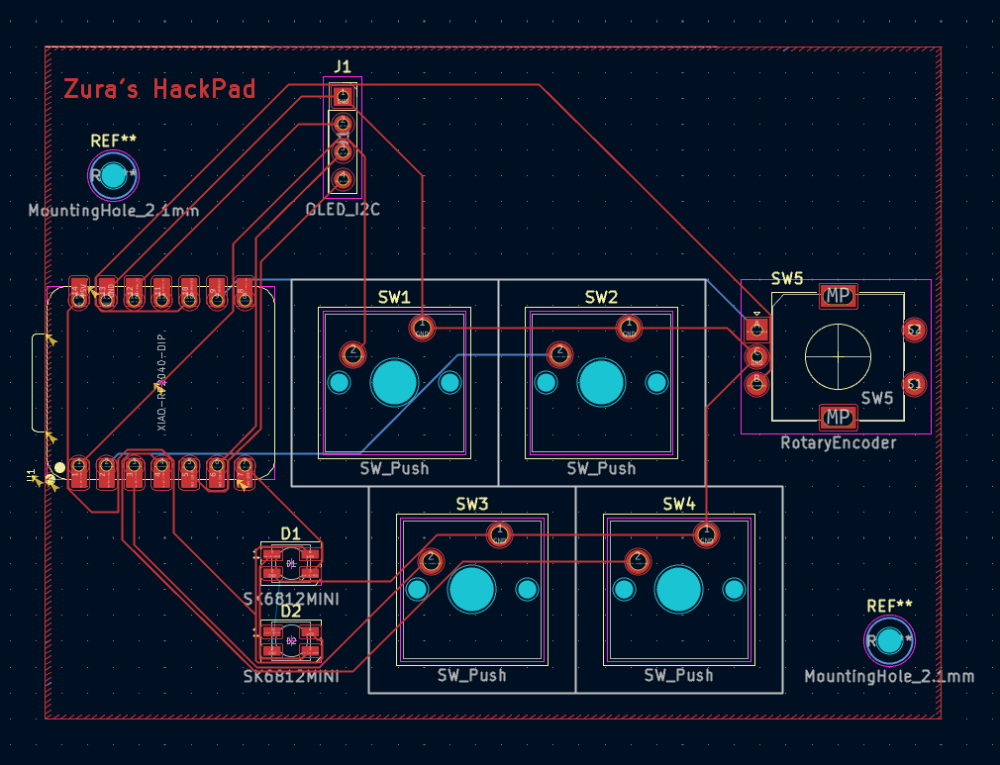
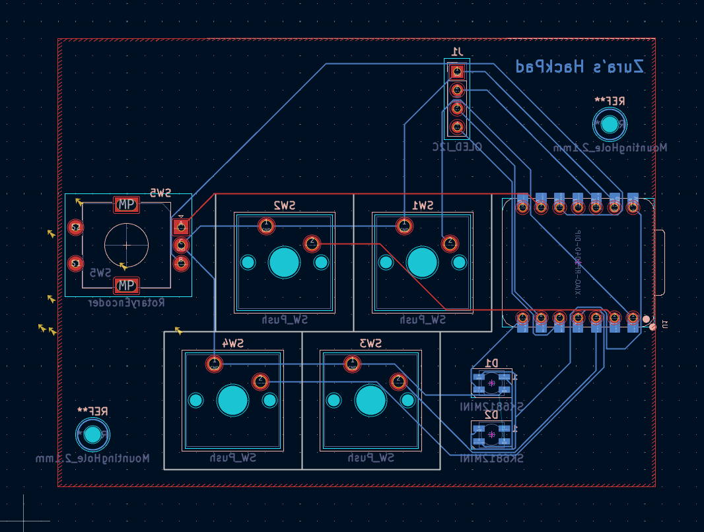
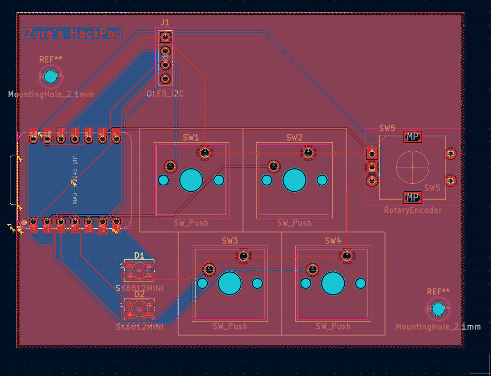
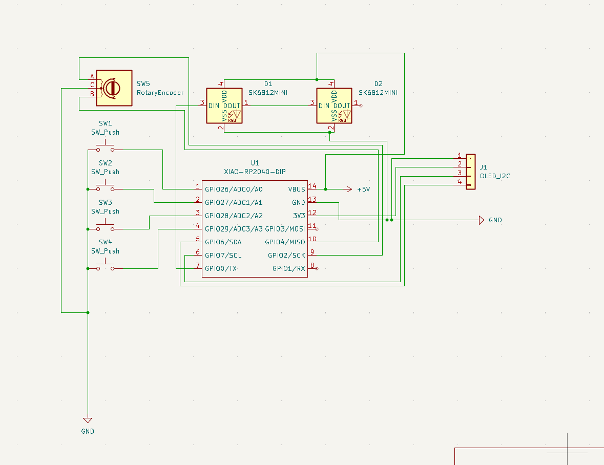
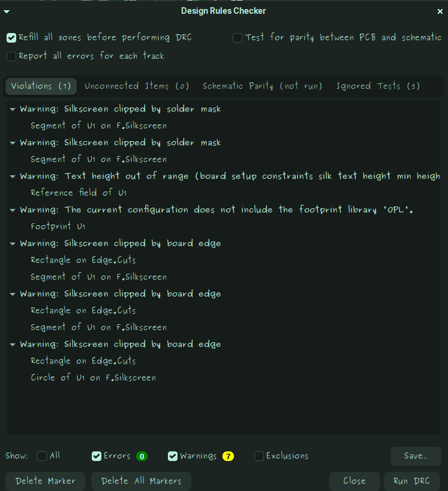

# Zura’s HackPad  
A fully custom Linux-focused macropad featuring 4 programmable hotkeys, a rotary encoder with push switch, RGB underglow, and a 0.91” I²C OLED display all powered by a Seeed XIAO RP2040.  
Designed, modeled, and routed entirely for the Hack Club *Blueprint* program.

---

## Features

### Current Working Features
These are implemented in `main.py` now.

#### 4 Macro Keys
**CP** | Copy | Sends `Ctrl + C` |
**FC** | Folder Create | Sends `Ctrl + Shift + N` |
**OT** | Open Terminal | Sends `Ctrl + Alt + T` |
**LFN** | Fn Lock | Sends `F14`|

#### Rotary Encoder
- Rotate: Volume Up / Down  
- Press: currently basic input (extended features planned)

#### RGB Underglow (SK6812 MINI)
- 2 LED chain  
- Controlled via GPIO0  
- Basic color output active (animations planned)

---

### Planned / Future Features

#### Smart Copy/Paste
- First press copies  
- Second press pastes  
- Clipboard-empty - paste anyway  

#### Encoder Modes
- Cycle between: Volume - Brightness - Media - Custom  

#### OLED Display
- Clipboard indicator  
- Volume & brightness  
- Battery/time  
- Overheat warning  
- Mode icons & animations  

---

## Bill of Materials (BOM)

Bill of Materials (BOM)

1. Seeed XIAO RP2040 – 1 piece  
   The main controller board.

2. MX-style switches – 4 pieces  
   Any standard Cherry MX compatible switches.

3. EC11 rotary encoder (with built-in button) – 1 piece  
   Has A/B pins and a push switch.

4. SK6812 Mini LEDs – 2 pieces  
   Addressable RGB LEDs, chained together.

5. 0.91" I2C OLED screen – 1 piece  
   Uses GND, VCC, SCL, and SDA.

6. 4-pin female header – 1 piece  
   For plugging in the OLED.

7. MX keycaps – 4 pieces  
   Any MX-compatible keycaps.

8. M3 screws + heat-set inserts – 4 sets  
   Used to assemble the case.

9. Custom PCB (2-layer) – 1 piece  
   Smaller than 100×100 mm.

---

## System Layout  
(Directly from KiCad nets)

### Switches - XIAO
- SW1 - GPIO26  
- SW2 - GPIO27  
- SW3 - GPIO28  
- SW4 - GPIO29  

### Rotary Encoder
- A - GPIO2  
- B - GPIO4  
- C - GND  

### RGB LEDs (SK6812)
- MCU GPIO0 - D1 DIN  
- D1 DOUT - D2 DIN  
- VDD - +5V  
- VSS - GND  

### OLED Header (J1)
- Pin 1 - GND  
- Pin 2 - 3V3  
- Pin 3 - SCL (GPIO7)  
- Pin 4 - SDA (GPIO6)

---

## Project Structure

```
zuras-hackpad/
├── CAD/
│   ├── HackPad_Bottom.step
│   ├── HackPad_Top.step
│   └── HackPad_Assembly.step
├── PCB/
│   ├── HackPad.kicad_pro
│   ├── HackPad.kicad_sch
│   └── HackPad.kicad_pcb
├── Firmware/
│   └── main.py
├── Images/
│   ├── Bottom.png
│   ├── Debug.png
│   ├── Full.png
│   ├── PDC-Back.png
│   ├── PDC-Finish.png
│   ├── PDC-Front.png
│   ├── Schematic.png
│   └── Top.png
└── README.md
```

---

## Required Screenshots

### Top View  


### Bottom View  


### Assembled Case With All The Components



### PCB – Front  


### PCB – Back  


### PCB – Final Routing  


### Schematic  


### Debug  


---
